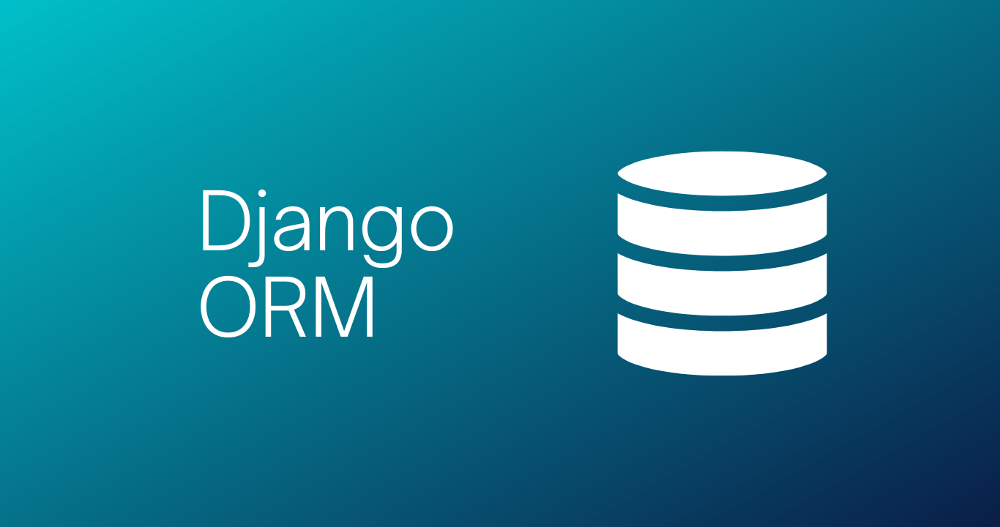

In Django's Object-Relational Mapping (ORM), `null` and `blank` are parameters used to define how a field should handle empty values:

## Null
This parameter is related to database schema.If `null` is set to `True` for a field, it means the field can store database NULL values, indicating that the field is optional. If set to `False`, the field is required to have a value on database level.

## Blank
This parameter is related to form or serializer validation. If "blank" is set to `True` for a field, it means the field can be left empty in a form or serializer(i.e., it's not required). If set to `False`, the field must have a value during  submission.

So if a field includes `null=True` and `blank=False`. Means at database level this field can be null, but on application level this field is required.This is particularly useful when you want to get data from frontend and perform some calculation based on that on application layer.

:::note
Avoid `null = True` on String based fields such as
  - CharField
  - TextField
:::

If you want `String` based field to be nullable, prefer this one
```python
class Person(models.Model):
	name = models.CharField(max_length=100) # required
	bio = models.TextField(max_length=500, blank=True) # optional
	birth_date = models.DateField(null=True, blank=True)
```


:::info
Default values of `null` and `blank` is False.
:::
 
