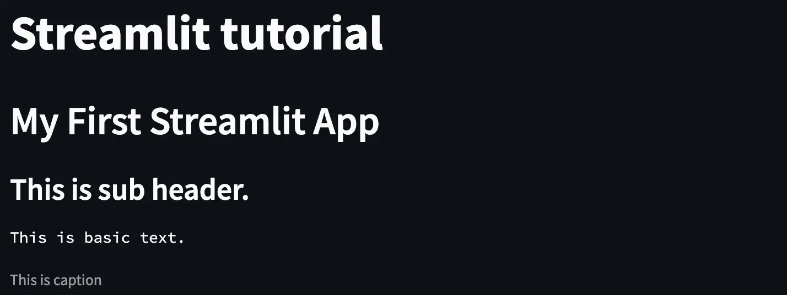
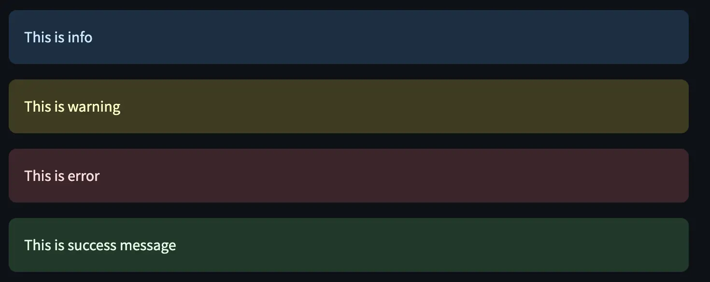
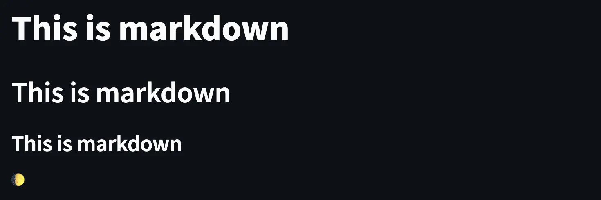
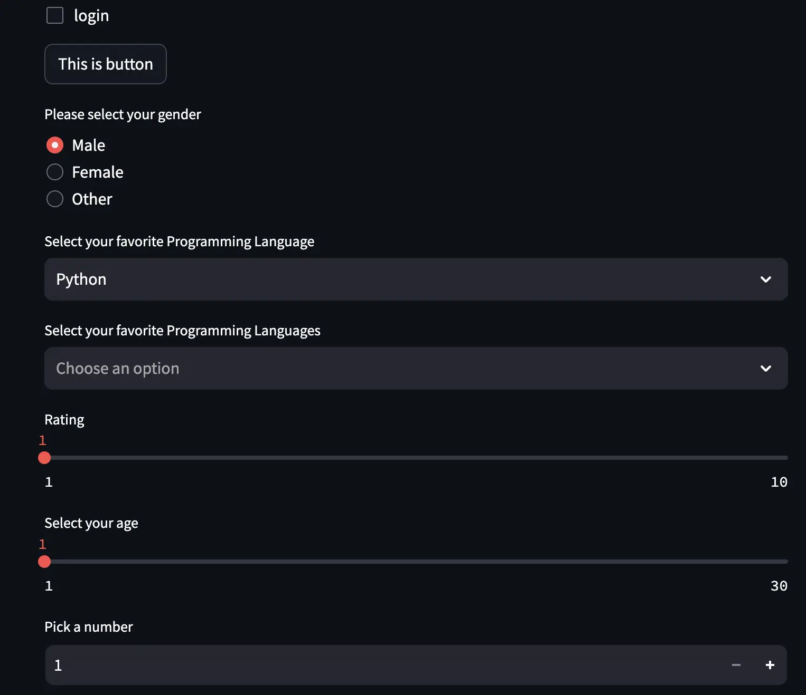
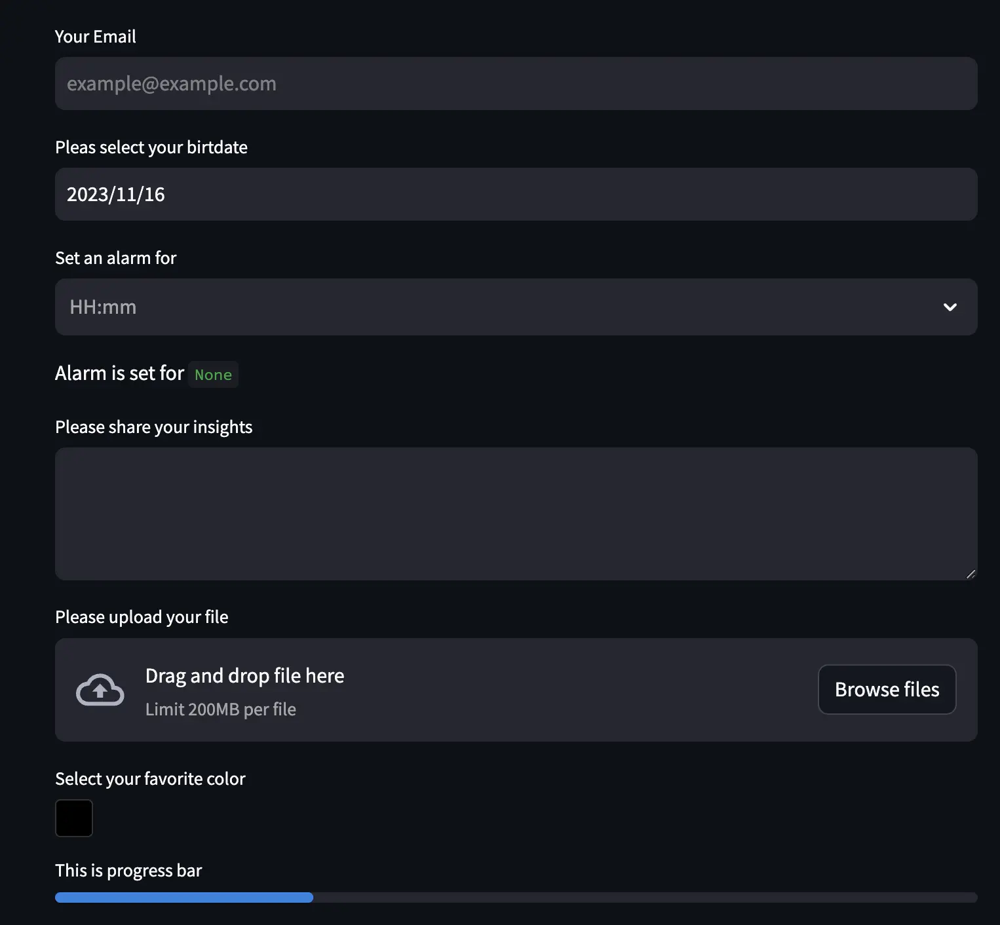
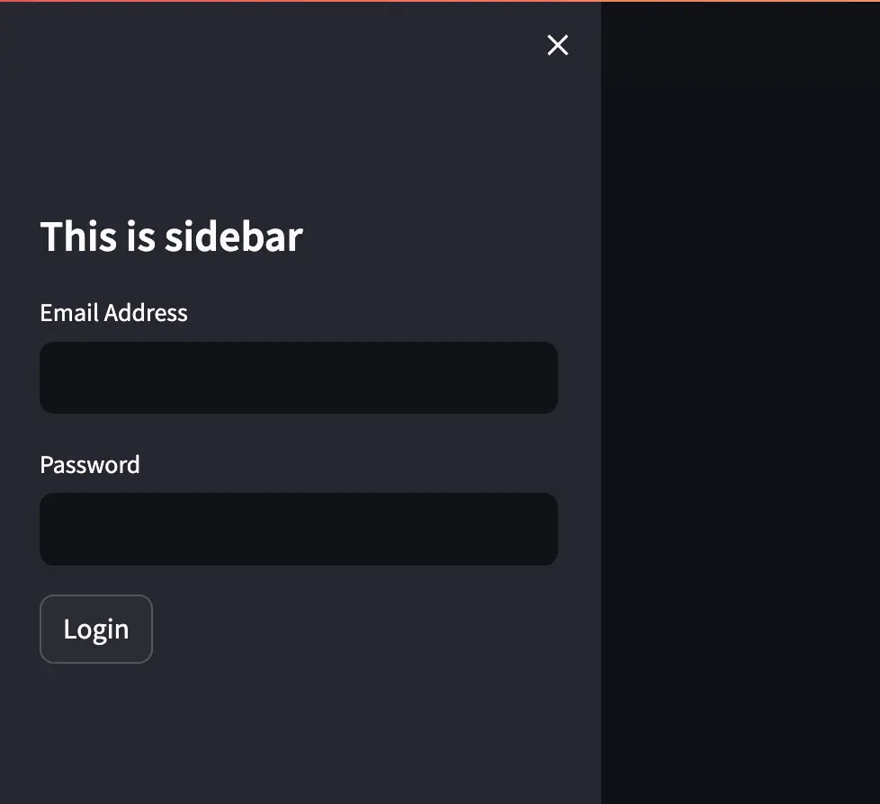
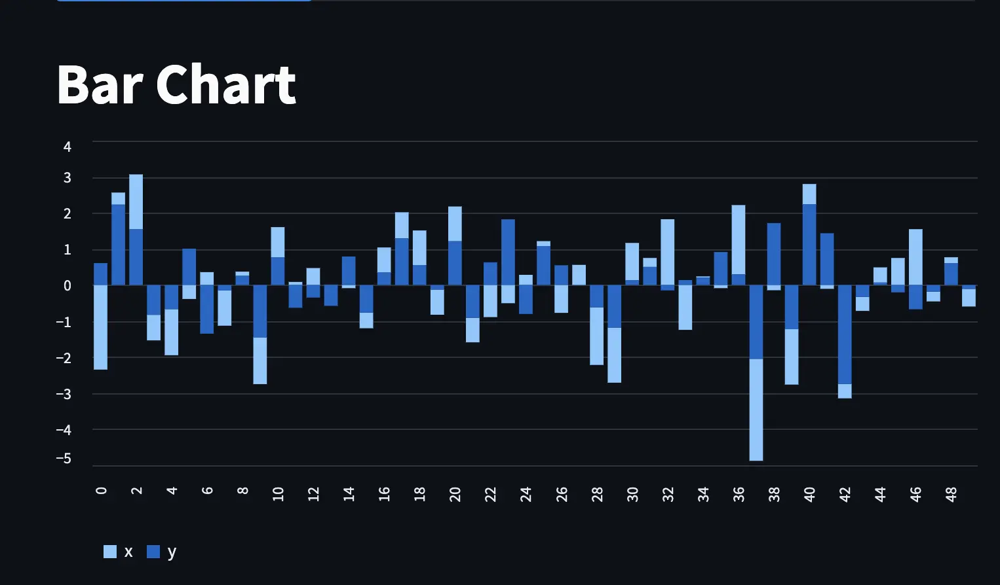
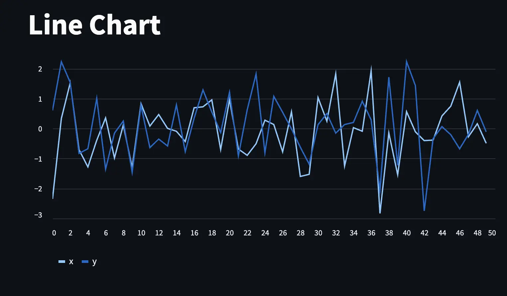
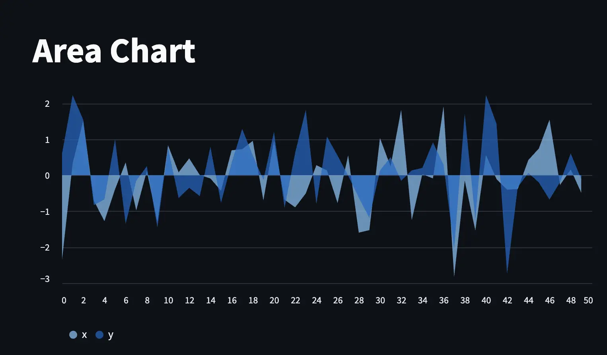

Streamlit is an open-source Python library that makes it incredibly easy and fun to create beautiful, interactive web apps for data science and machine learning projects.

<!--truncate-->


In the rapidly evolving field of data science, presenting data in an interactive and user-friendly manner is just as crucial as the analysis itself. This is where Streamlit, an open-source Python library, shines by transforming data scripts into shareable web apps with minimal effort.

## The Streamlit Advantage:
Streamlit stands out for its simplicity and efficiency. With a few lines of Python code, you can turn data analyses into interactive web apps. This is a game-changer for data scientists and analysts who want to showcase their findings or build data tools without delving deep into web development.

## Key Features:
- **Ease of Use:** Streamlit's straightforward syntax and structure make it accessible even for beginners.
- **Rapid Prototyping:** It allows for quick iteration, which is essential for testing and developing data science models.
- **Interactivity:** Features like sliders, buttons, and forms make it easy to manipulate and visualize data dynamically.
- **Customization:** Despite its simplicity, Streamlit offers a range of customization options to tailor the appearance of your apps.

## Real-World Applications:
From simple data visualizations to complex machine learning models, Streamlit can handle a variety of applications. It's ideal for creating dashboards, data exploration tools, or even integrating machine learning models for real-time predictions.

### Getting Started with Streamlit:
To get started, all you need is basic Python knowledge. Installation is straightforward using pip:

```python
pip install streamlit
```

:::info
It is recommended to use a Virtual Environment to isolate and manage project-specific dependencies.
```bash
# create virtual env
python3 -m venv .venv

# activate env
source .venv/bin/activate
```
:::

To run the server hit the following command on the terminal. Make sure you are in the right directory.
```bash
streamlit hello
```
This will start the server and you will see a window open on your browser. Congratulations `streamlit` app is up and running 🚀

### Components of Streamlit
Streamlit offer alot of components to make highly interactive web app.
Let's delve into the basic components and learn how to utilize them effectively.

Create a new python file called `app.py` in your directory where you have created virtual env.
Now open this python file in your favorite editor and let's start coding.

:::info
To run your project hit the following command.
```
streamlit run app.py
```
:::

### Display Texts with Streamlit
```python
import streamlit as st

st.title("Streamlit tutorial")

st.header("My First Streamlit App")
st.subheader("This is sub header.")
st.text("This is basic text.")
st.caption("This is caption")
```
**This is how the output looks like.**


### Display Messages 
```python
st.info("This is info")
st.warning("This is warning")
st.error("This is error")
st.success("This is success message")
```
**This is how the output looks like.**


### Display Markdown 
```python
st.markdown("# This is markdown")
st.markdown("## This is markdown")
st.markdown("### This is markdown")
st.markdown(":moon:")
```
**This is how the output looks like.**


### Display widgets
```python
st.checkbox("login")
st.button("This is button")
st.radio("Please select your gender", ["Male", "Female", "Other"])
st.selectbox(
    "Select your favorite Programming Language", ["Python", "Java", "javaScript", "Go"]
)
st.multiselect(
    "Select your favorite Programming Languages", ["Python", "Java", "javaScript", "Go"]
)
st.select_slider("Rating", [1, 2, 3, 4, 5, 6, 7, 8, 9, 10])
st.slider("Select your age", 1, 30)
st.number_input("Pick a number", 1, 100)
```

```python
st.text_input(
    "Your Email", placeholder="example@example.com"
)  # you cannot directly apply regex here for validation
st.date_input("Pleas select your birtdate")

t = st.time_input("Set an alarm for", value=None)
st.write("Alarm is set for", t)

st.text_area("Please share your insights")

st.file_uploader("Please upload your file")

st.color_picker("Select your favorite color")

st.progress(28, text="This is progress bar")

with st.spinner("you are in luck"):
    time.sleep(2)
```


### Display Sidebar
```python
st.sidebar.title("This is sidebar")
st.sidebar.text_input("Email Address")
st.sidebar.text_input("Password")
st.sidebar.button("Login")
```



### Display Dashboards
```python
import pandas as pd
import numpy as np

data = pd.DataFrame(np.random.randn(50, 2), columns=["x", "y"])

st.title("Bar Chart")
st.bar_chart(data=data)
```


```python
import pandas as pd
import numpy as np

data = pd.DataFrame(np.random.randn(50, 2), columns=["x", "y"])

st.title("Line Chart")
st.line_chart(data=data)

```


```python
import pandas as pd
import numpy as np

data = pd.DataFrame(np.random.randn(50, 2), columns=["x", "y"])

st.title("Area Chart")
st.area_chart(data=data)
```
